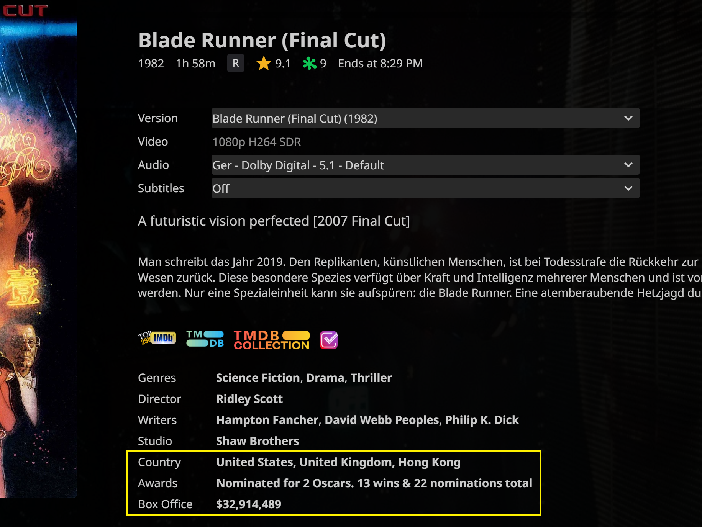

## Fork changes :
- Display ***Worldwide Box Office*** instead of *Domestic Box Office* (with fallback to OMDb Domestic BoxOffice if TMDB Worldwide Box Office is empty)
- Display $9999999 **(Worldwide)** or $9999999 **(Domestic)** accordingly
- Jellyfin Android App external links fix
- Requires OMDb API key **and a TMDB key (free)**

# Jellyfin DetailsGroupItems Extension

For **Jellyfin Web**, works with **JavaScript Injector**, requires **OMDb API key** (free key 1000 requests per day).

This script extends Jellyfin’s **DetailsGroupItems** section (Genres, Directors, Writers, Studios) with additional metadata fetched from **OMDb**. It adds **Country**, **Awards**, and **Box Office** information directly to the item details view.

For movies, the script supports displaying country of origin, awards information, and box office data.  
For TV shows, country of origin and awards information can be shown on the main series page.  
Each row can be shown or hidden independently, and only enabled rows are rendered.

The order in which the rows appear is fully configurable for movies and TV shows individually. Rows that are disabled or removed from the configured order are completely removed from the UI. The injected rows fully match the appearance and behavior of Jellyfin’s native DetailsGroupItems. Font weight, underline handling, hover effects, and interaction behavior are adjusted so the additional metadata integrates seamlessly and is visually indistinguishable from the original entries. 

Optional: On click external links are resolved automatically by parsing the available provider IDs, ensuring that each row opens the correct destination depending on media type and context.  
country   → IMDb Locations page (imdb.com/title/{imdbId}/locations/)  
awards    → IMDb Awards page or TMDb Awards page (TMDb only for movies, if configured)  
boxoffice → Box Office Mojo page (boxofficemojo.com/title/{imdbId})  

---

## Installation

- Intended for **Jellyfin Web**
- Requires a **JavaScript Injector** (e.g. Jellyfin JavaScript Injector plugin or userscript manager)
- Paste the script into the injector
- Don't forget to insert your **OMDb API key** **and a TMDB key (free)** into the script
- Config the scripts optionals to your needs
- Save and reload the Jellyfin Web interface

---

## Tested on

- Windows 11  
- Chrome & Firefox
- Jellyfin Web 10.10.7
- & Jellyfin Web 10.11.6

---

## License

MIT
